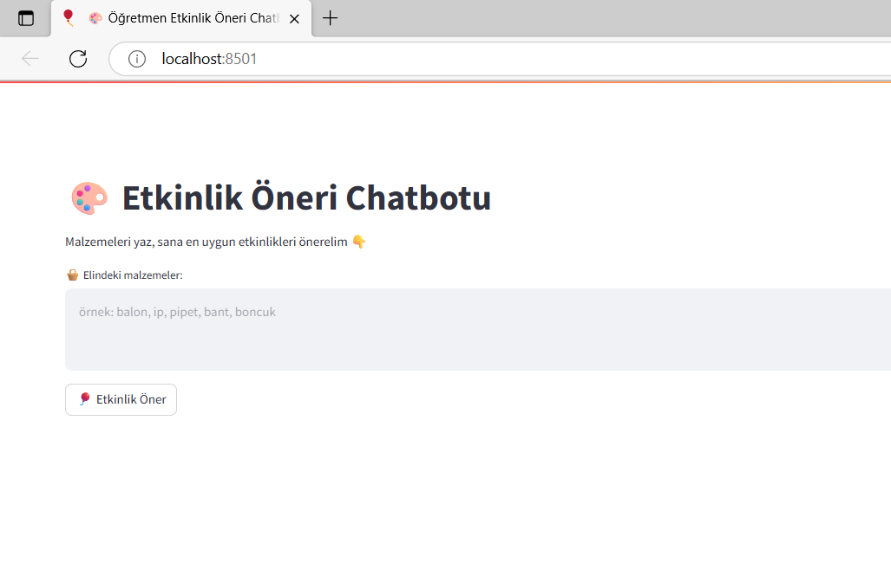
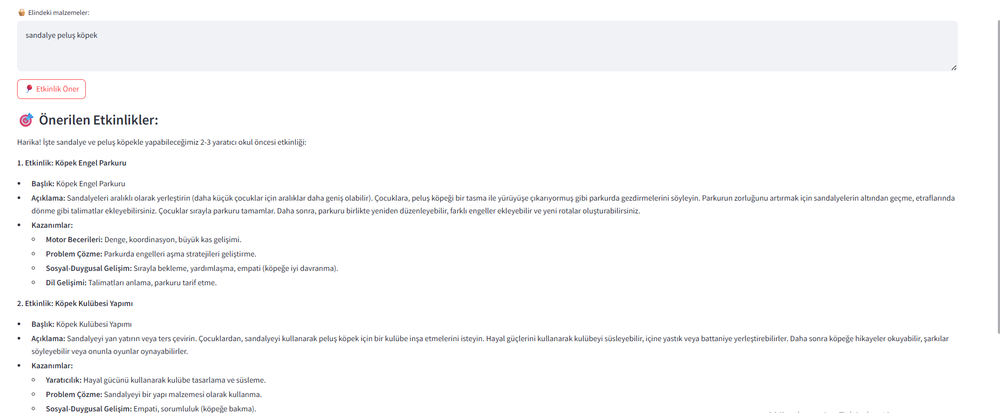

# Öğretmen Etkinlik Öneri Chatbotu

Bu proje, **okul öncesi ve sınıf öğretmenlerinin** elindeki malzemelere göre uygun etkinlikleri önermesini sağlayan bir **RAG tabanlı chatbot** sistemidir.Sınıf öğretmeni olan yakın arkadaşımın sürekli yeni etkinlik bulma konusunda zorluk yaşamasından ilham alınarak gündelik hayat problemine çözüm üretmek için tasarlanmıştır.  
Model, **Türkçe destekli embedding** (SentenceTransformers) ve **Google Gemini 2.0 API** ile anlam temelli etkinlik önerileri üretir.

---

## Proje Amacı

Öğretmenler çoğu zaman “Elimde balon, ip ve pipet var; ne etkinliği yapabilirim?” gibi sorulara hızlı yanıt arar.  
Bu proje, 53 etkinlikli bir veri tabanı üzerinden **malzeme bazlı öneriler** üretir.

Chatbot:
-  Öğretmenden malzeme girdisini alır  
-  En yakın etkinlikleri vektör benzerliği ile bulur  
-  Gemini 2.0 Flash modeliyle anlamlı öneriler üretir  

---
## Veri Seti

Bu projede kullanılan verileri okul öncesi ve sınıf düzeyindeki öğretmenlerin sıklıkla kullandığı materyal ve etkinlik örneklerine bakarak kendim oluşturdum.
Her kayıt; etkinlik adı, kullanılan malzemeler, yaş grubu, gelişim alanı, süre, açıklama ve kazanımlardan oluşur.  

---

##  Sistem Mimarisi

```
Kullanıcı Girdisi (malzemeler)
        │
        ▼
[SentenceTransformer Embedding] → metni vektöre çevir
        │
        ▼
[ChromaDB] → en yakın etkinlikleri bul
        │
        ▼
[Gemini 2.0 API] → doğal dilde etkinlik önerisi üret
        │
        ▼
[Streamlit Arayüzü] → kullanıcıya göster
```

---

##  Kullanılan Teknolojiler

| Teknoloji | Amaç | Neden Seçildi? |
|------------|------|----------------|
| **Python 3.10+** | Proje dili | Geniş ekosistem, AI desteği |
| **Streamlit** | Web arayüzü | Hızlı prototipleme, kullanıcı dostu |
| **ChromaDB** | Vektör veritabanı | RAG sistemleri için optimize |
| **SentenceTransformer** (`paraphrase-multilingual-MiniLM-L12-v2`) | Türkçe embedding | Anlam bazlı benzerlik, offline çalışır |
| **Google Gemini 2.0 Flash** | LLM (Cevap üretimi) | Hızlı, Türkçe destekli, güçlü |
| **python-dotenv** | API anahtarı yönetimi | Güvenli yapılandırma |

---

##  Dosya Yapısı

```
ogretmen-chatbot/
│
├── etkinlikler_dataset.md      # 53 etkinlikli veri seti
├── create_database.py          # Embedding veritabanı oluşturur
├── streamlit_app.py            # Ana uygulama arayüzü
├── requirements.txt            # Gereklilikler
├── .gitignore                  # API anahtarı
└── chroma/                     # Otomatik oluşur (vektör DB)
```

---

##  Kurulum ve Çalıştırma

### 1- Bu projeyi klonlayın
   ```bash
   git clone https://github.com/eda027/ogretmen_chatbot.git
   cd ogretmen_chatbot
```

### 2- Gerekli kütüphaneleri yükle
```bash
pip install -r requirements.txt
```

### 3- .env dosyasını oluştur
```bash
GEMINI_API_KEY=senin_gemini_api_anahtarın
```
> API anahtarını buradan alabilirsin:  
>  [https://makersuite.google.com/app/apikey](https://makersuite.google.com/app/apikey)

### 4- Embedding veritabanını oluştur
```bash
python create_database.py
```
Çıktı şöyle olmalı:
```
 Toplam 53 etkinlik bulundu.
 Türkçe embedding modeli ile veritabanı başarıyla oluşturuldu.
```

### 5- Uygulamayı çalıştır
```bash
streamlit run streamlit_app.py
```
Tarayıcıda aç:
 [http://localhost:8501](http://localhost:8501)

---

## Uygulama Ekran Görüntüleri

Aşağıda chatbot arayüzünün çalışma aşamalarından örnek ekran görüntüleri yer almaktadır:

### 1. Ana Arayüz


### 2. Etkinlik Önerisi Çıktısı


---


